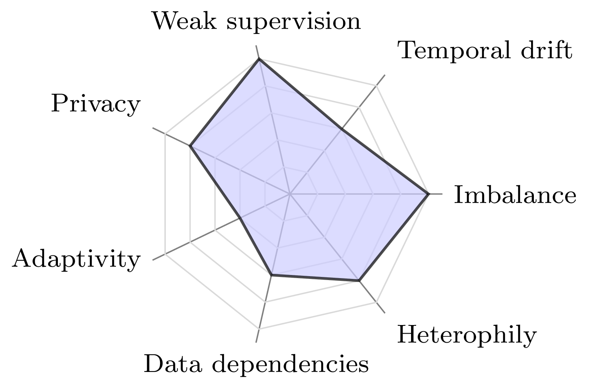
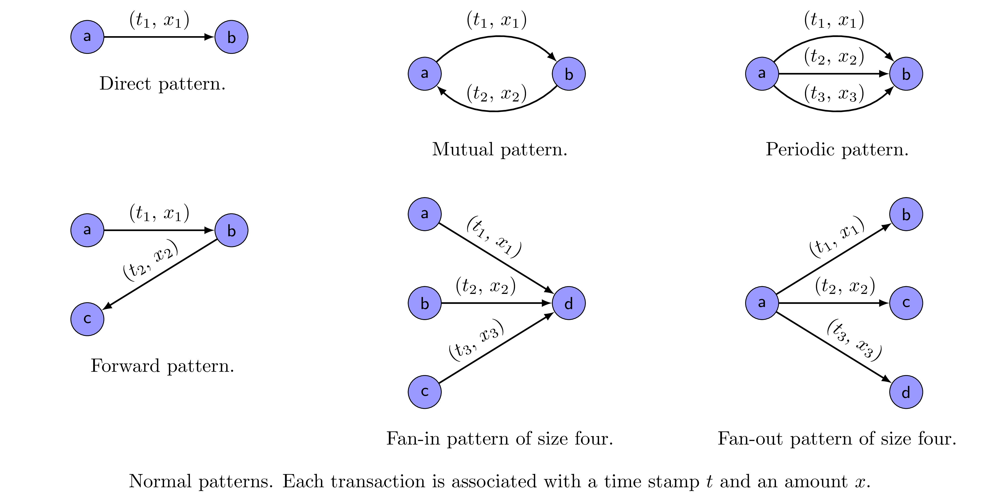
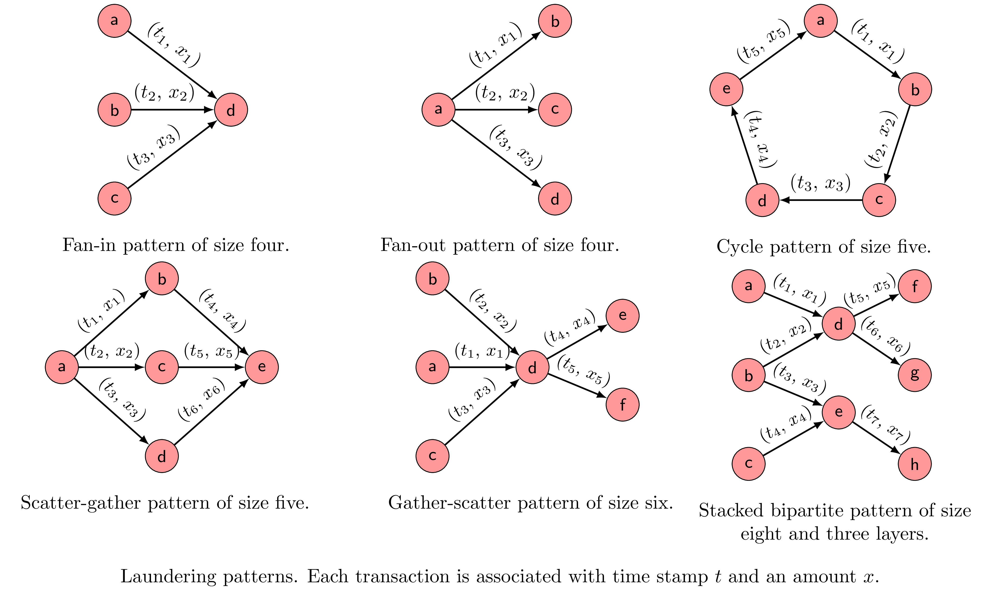
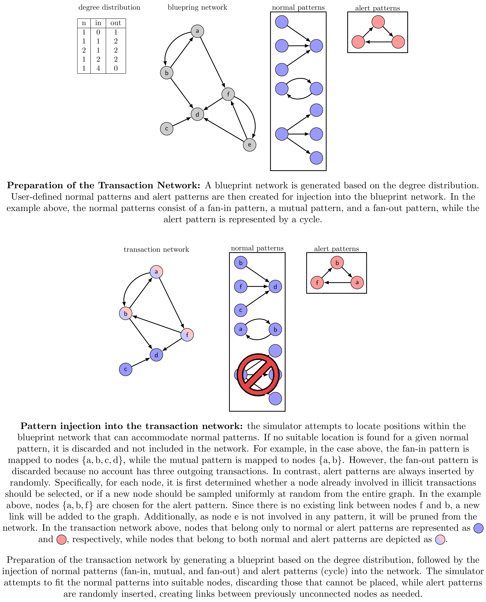
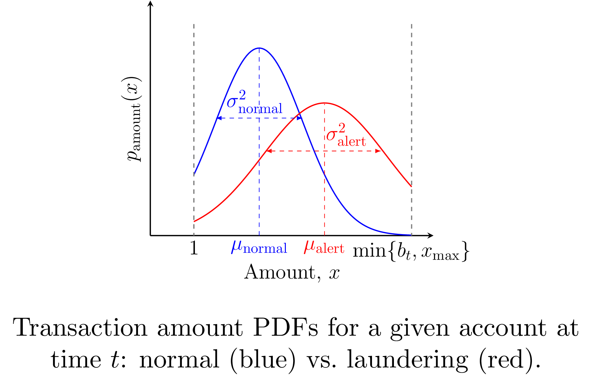
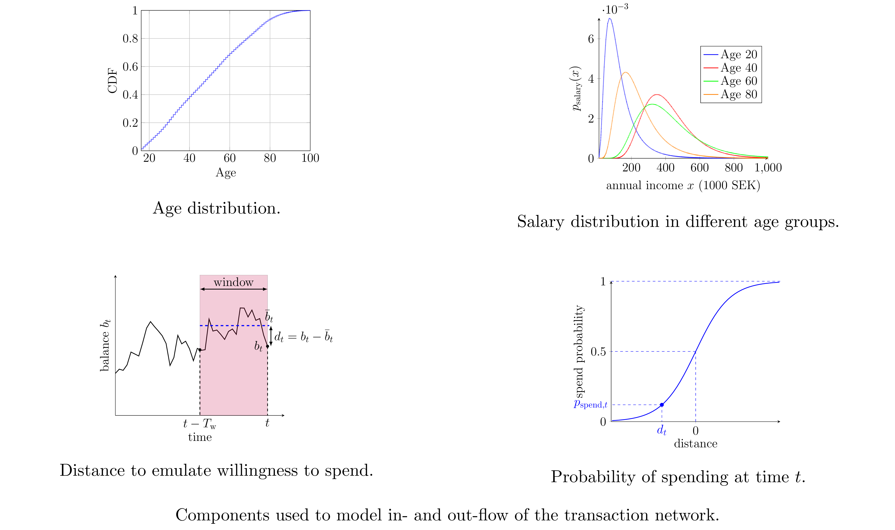
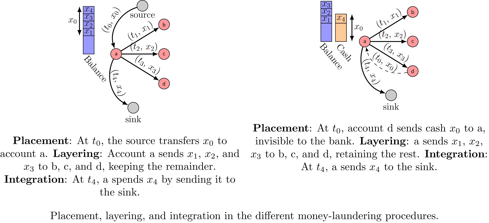
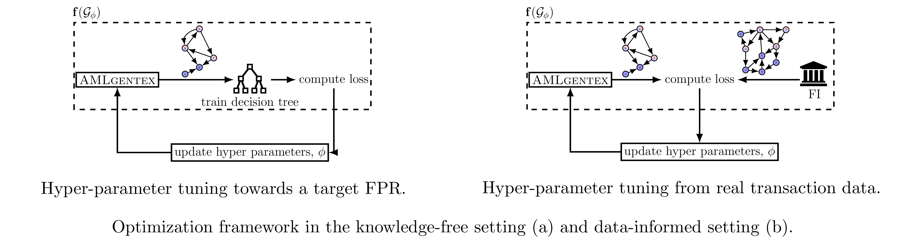
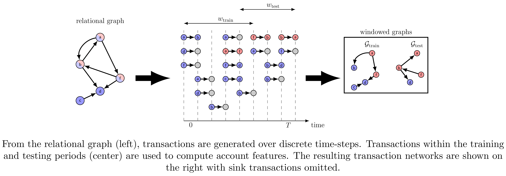
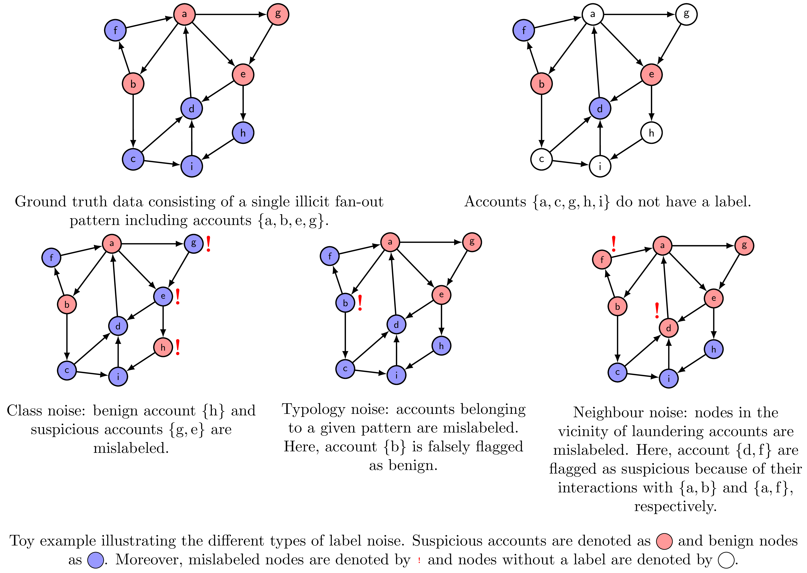

# AMLGentex

**Mobilizing Data-Driven Research to Combat Money Laundering**

AMLGentex is a comprehensive benchmarking framework for anti-money laundering (AML) research, developed by AI Sweden in collaboration with Handelsbanken and Swedbank. It enables generation of realistic synthetic transaction data, training of machine learning models, and application of explainability techniques to advance AML detection systems.

[](https://arxiv.org/abs/2506.13989)
[](https://www.python.org/downloads/)
[](LICENSE)
[](https://github.com/aidotse/AMLGentex/actions/workflows/tests.yml)
[](https://github.com/aidotse/AMLGentex/actions/workflows/tests.yml)

---

## Terminology

- **SAR**: Suspicious Activity Report - accounts/transactions flagged as suspicious
- **SWISH**: Swedish Instant Payment System - mobile payment system
- **AML**: Anti-Money Laundering - detecting and preventing money laundering
- **Transaction**: payment between two accounts
- **Income**: Money entering account from external source (salary)
- **Outcome**: Money leaving account to external sink (spending)
- **Normal Pattern**: Regular transaction behavior (fan-in, fan-out, mutual, forward, periodical, single)
- **Alert Pattern**: Suspicious transaction behavior (cycle, bipartite, stack, random, gather-scatter, scatter-gather)
- **Spatial**: Network topology (who can transact with whom)
- **Temporal**: Time-series of transactions

---

## Table of Contents

- [Overview](#overview)
- [Installation](#installation)
- [Quick Start](#quick-start)
- [Data Generation](#data-generation)
  - [Spatial Graph Generation](#spatial-graph-generation)
  - [Temporal Transaction Simulation](#temporal-transaction-simulation)
  - [Bayesian Optimization](#bayesian-optimization)
- [Feature Engineering](#feature-engineering)
- [Machine Learning](#machine-learning)
  - [Training Regimes](#training-regimes)
  - [Supported Models](#supported-models)
  - [Adding New Models](#adding-new-models)
- [Configuration Reference](#configuration-reference)
- [Usage Examples](#usage-examples)
- [Citation](#citation)

---

## Overview

AMLGentex provides a complete pipeline for generating, training, and evaluating machine learning models for AML detection. The framework is loosely based on the Swedish mobile payment system SWISH but is easily extensible to other payment systems. For a detailed description of the framework and its components, see the [AMLGentex paper](https://arxiv.org/abs/2506.13989) and its appendix.

### Real-World Challenges Addressed

AMLGentex captures a range of real-world data complexities identified by AML experts from Swedbank and Handelsbanken:

<p align="center">
  
  <br>
  <em>Figure 1: Expert-assessed severity of key challenges in AML transaction monitoring</em>
</p>

### Key Capabilities

- **Data Generation**: Create realistic synthetic transaction networks with controllable complexity
- **Pattern Injection**: Insert both normal and suspicious (SAR) transaction patterns
- **Training Flexibility**: Train models in three settings (centralized, federated, isolated)
- **Optimization**: Two-level Bayesian optimization for data generation and model hyperparameters
- **Model Support**: 8 ML models (Decision Trees, Random Forests, GBM, Logistic Regression, MLP, GCN, GAT, GraphSAGE) - easily extensible
- **Visualization**: Interactive tools for exploring transaction networks

---

## Installation

**Requirements:** Python 3.10+

```bash
# Clone repository
git clone https://github.com/aidotse/AMLGentex.git
cd AMLGentex

# Install dependencies using uv (recommended - fast!)
pip install uv
uv sync

# Or use pip
pip install -e .

# Optional: Install visualization tools
pip install -e ".[viz]"
pip install -e ".[network-explorer]"
```

**Key Dependencies:**
- `pandas`, `numpy`, `scikit-learn` - Data processing and ML
- `torch`, `torch_geometric` - Graph neural networks
- `optuna` - Bayesian optimization
- `pyarrow` - Parquet file support (4x smaller than CSV)
- `pyyaml` - Configuration management
- `panel`, `holoviews`, `datashader` - Interactive visualization

---

## Quick Start

### 📓 Interactive Tutorial (Recommended)

The fastest way to get started is with our comprehensive Jupyter notebook:

```bash
jupyter notebook tutorial.ipynb
```

**Tutorial covers:** Creating experiments, generating data, preprocessing, training models, and visualization.

---

### Command-Line Workflow

**Step 1: Generate synthetic data**
```bash
uv run python scripts/generate.py --conf_file experiments/template_experiment/config/data.yaml
```

**Step 2 (Optional): Optimize data generation**
```bash
uv run python scripts/tune_data.py \
    --experiment_dir experiments/template_experiment \
    --num_trials_data 50 \
    --num_trials_model 100 \
    --model DecisionTreeClassifier
```

**Step 3: Engineer features**
```bash
uv run python scripts/preprocess.py --conf_file experiments/template_experiment/config/preprocessing.yaml
```

**Step 4: Train models**
```bash
uv run python scripts/train.py \
    --experiment_dir experiments/template_experiment \
    --model DecisionTreeClassifier \
    --training_regime centralized
```

---

## Data Generation

Data generation follows a three-stage process: **spatial graph generation**, **temporal transaction simulation**, and **Bayesian optimization** for parameter tuning.

### Spatial Graph Generation

The spatial stage creates the transaction network topology. This determines which accounts can transact with each other.

#### 1. Scale-Free Network Blueprint

AMLGentex generates scale-free networks where node degree follows a truncated discrete power-law distribution with exponential cutoff:

$$P(K=k) \propto k^{-\gamma} \exp\left(-\frac{2k}{k_{\max}}\right), \quad k \in \{k_{\min}, \ldots, k_{\max}\}$$

The exponential cutoff provides softer tail truncation, more realistic for finite-size networks and preventing extreme degree concentration near k_max.

**Parameters:**
- **`kmin`**: Minimum degree (default: 1)
- **`kmax`**: Maximum degree (default: floor(√n), capped at n-1 for simple graphs)
- **`gamma`**: Power-law exponent (optional - solved from average_degree if not provided)
- **`average_degree`**: Target mean degree (specify this OR gamma)

**Computing gamma from average_degree:**

The expected degree for a given γ is:

$$\mu(\gamma) = \frac{\sum_{k=k_{\min}}^{k_{\max}} k \cdot k^{-\gamma} \exp(-2k/k_{\max})}{\sum_{k=k_{\min}}^{k_{\max}} k^{-\gamma} \exp(-2k/k_{\max})}$$

This function is strictly decreasing in γ: smaller γ → heavier tail → larger mean; larger γ → mass concentrates at k_min → smaller mean.

Given a target average degree, we solve μ(γ) = target using Brent's method. The exponential cutoff ensures smooth decay near k_max, and monotonicity guarantees a unique solution.

**Example: n=10,000 nodes (kmax=100)**

| Target Mean | γ |
|-------------|-------|
| 1.5 | 2.67 |
| 2.0 | 2.23 |
| 3.0 | 1.85 |
| 5.0 | 1.49 |
| 10.0 | 1.06 |
| 20.0 | 0.58 |

**Survival function P(K > k):**

| k | μ=1.5 | μ=2.0 | μ=3.0 | μ=5.0 | μ=10.0 | μ=20.0 |
|-----|-------|-------|-------|-------|--------|--------|
| 1 | 21.1% | 30.3% | 41.4% | 54.5% | 72.2% | 88.7% |
| 5 | 2.2% | 5.2% | 11.0% | 20.9% | 40.2% | 66.7% |
| 10 | 0.6% | 1.9% | 5.0% | 11.3% | 26.3% | 51.7% |
| 20 | 0.1% | 0.6% | 1.9% | 5.1% | 14.4% | 34.1% |
| 50 | <0.1% | 0.1% | 0.3% | 1.0% | 3.7% | 11.3% |
| 90 | <0.1% | <0.1% | <0.1% | 0.1% | 0.3% | 1.2% |

**Expected nodes with degree > k (n=10,000):**

| k | μ=1.5 | μ=2.0 | μ=3.0 | μ=5.0 | μ=10.0 | μ=20.0 |
|-----|-------|-------|-------|-------|--------|--------|
| 10 | 62 | 192 | 498 | 1,133 | 2,633 | 5,175 |
| 20 | 14 | 58 | 186 | 509 | 1,441 | 3,415 |
| 50 | 1 | 7 | 29 | 99 | 365 | 1,128 |
| 90 | <1 | <1 | 2 | 8 | 33 | 121 |

The exponential cutoff smoothly suppresses extreme degrees rather than imposing a hard wall at kmax.

#### 2. Pattern Injection

**Normal Patterns:** Regular transaction behaviors inserted first, respecting network constraints.

<p align="center">
  
  <br>
  <em>Figure 3: Normal transaction patterns - single, fan-in, fan-out, forward, mutual, periodical</em>
</p>

**Alert Patterns:** Suspicious activities (SAR patterns) inserted on top of the normal network.

<p align="center">
  
  <br>
  <em>Figure 4: Alert patterns - fan-in, fan-out, cycle, bipartite, stack, random, gather-scatter, scatter-gather</em>
</p>

#### 3. Complete Network Creation Pipeline

<p align="center">
  
  <br>
  <em>Figure 5: From degree distribution blueprint to final spatial graph with injected patterns</em>
</p>

#### 4. KYC Demographics Assignment

Before alert pattern injection, AMLGentex assigns realistic demographic attributes (KYC - Know Your Customer) to all accounts based on population statistics:

**Assigned Attributes:**
- **Age** (years): Population-sampled from demographics CSV (16-100 years)
- **Salary** (monthly SEK): Log-normal distribution per age group
- **Balance** (SEK): Derived from salary + structural position + noise
  - Formula: `log(balance) = α_salary·log(salary) + α_struct·z(struct) + noise`
  - Calibrated to median: `balance_months × population_median_salary`
- **City** (categorical): BFS propagation from high-degree hub seeds

**KYC Data Flow:**

```
┌─────────────────┐     ┌─────────────────────┐     ┌─────────────────┐
│ demographics.csv│     │ DemographicsAssigner│     │  accounts.csv   │
│                 │────▶│                     │────▶│                 │
│ age, salary     │     │ • Sample age        │     │ AGE, SALARY,    │
│ statistics      │     │ • Derive salary     │     │ INIT_BALANCE,   │
└─────────────────┘     │ • Compute balance   │     │ CITY            │
                        │ • Assign city (BFS) │     └────────┬────────┘
                        └─────────────────────┘              │
                                                             ▼
┌─────────────────┐     ┌─────────────────────┐     ┌─────────────────┐
│   ML Features   │     │    Preprocessor     │     │ Temporal Sim    │
│                 │◀────│                     │◀────│                 │
│ age, salary,    │     │ • Load static attrs │     │ • Salary →      │
│ city_0, city_1, │     │ • One-hot city      │     │   income/spend  │
│ ...             │     │ • Balance fallback  │     │ • Balance →     │
└─────────────────┘     └─────────────────────┘     │   starting bal  │
                                                    └─────────────────┘
```

**Configuration** in `data.yaml`:

```yaml
demographics:
  csv_path: demographics.csv  # Population statistics
  balance_params:
    balance_months: 2.5      # Target median (months of salary)
    alpha_salary: 0.6        # Salary elasticity
    alpha_struct: 0.4        # Structural position effect
    sigma: 0.5               # Noise std dev
```

**Demographics CSV Format:**
```csv
age, average year income (tkr), median year income (tkr), population size
16, 5.7, 0.0, 118238.0
17, 11.5, 5.3, 117938.0
...
```

**Key Insight:** Balance correlates meaningfully with both salary (via `alpha_salary`) and graph structure (via `alpha_struct`), creating realistic wealth distribution for ML detection.

#### 5. ML Account Selection

When injecting alert patterns, AMLGentex uses a weighted selection system to choose which accounts participate in money laundering. This creates realistic patterns where structurally important accounts (hubs, bridges) are more likely to be involved.

**Weight Computation Flow:**

```
┌──────────────────────────────────────────────────────────────────────────────┐
│                           ML ACCOUNT SELECTOR                                 │
├──────────────────────────────────────────────────────────────────────────────┤
│                                                                              │
│  ┌─────────────────┐   ┌─────────────────┐   ┌─────────────────┐            │
│  │ STRUCTURAL      │   │ KYC ATTRIBUTES  │   │ LOCALITY (PPR)  │            │
│  │                 │   │                 │   │                 │            │
│  │ • degree        │   │ • init_balance  │   │ • city_global   │            │
│  │ • betweenness   │   │ • salary        │   │   (Personalized │            │
│  │ • pagerank      │   │ • age           │   │    PageRank)    │            │
│  └────────┬────────┘   └────────┬────────┘   └────────┬────────┘            │
│           │                     │                     │                      │
│           ▼                     ▼                     ▼                      │
│  ┌─────────────────────────────────────────────────────────────┐            │
│  │                    NORMALIZE (z-score)                       │            │
│  │     log transform for skewed metrics (degree, balance)       │            │
│  └─────────────────────────────────────────────────────────────┘            │
│                                 │                                            │
│                                 ▼                                            │
│  ┌─────────────────────────────────────────────────────────────┐            │
│  │              WEIGHTED COMBINATION                            │            │
│  │   score = β·z_structural + γ·z_kyc + δ·z_propagation        │            │
│  └─────────────────────────────────────────────────────────────┘            │
│                                 │                                            │
│                                 ▼                                            │
│  ┌─────────────────────────────────────────────────────────────┐            │
│  │                    SOFTMAX                                   │            │
│  │           ml_weight = exp(score - max_score)                 │            │
│  └─────────────────────────────────────────────────────────────┘            │
│                                 │                                            │
│                                 ▼                                            │
│  ┌─────────────────────────────────────────────────────────────┐            │
│  │              WEIGHTED RANDOM SELECTION                       │            │
│  │     Select account → Apply participation_decay → Repeat      │            │
│  └─────────────────────────────────────────────────────────────┘            │
│                                                                              │
└──────────────────────────────────────────────────────────────────────────────┘
```

**Selection Weights** combine three components:

| Component | What it measures | ML Rationale |
|-----------|------------------|--------------|
| **Degree** | Number of connections | Hub accounts have more layering opportunities |
| **Betweenness** | Bridge between communities | Good for laundering through "neutral" middlemen |
| **PageRank** | Importance from incoming links | Collection points in gather/fan-in patterns |
| **KYC attributes** | Balance, salary, age | Bias selection based on account demographics (configurable) |
| **Locality (PPR)** | Geographic clustering | Real ML networks often cluster geographically |

**Participation Decay** prevents a few high-weight accounts from dominating all patterns. After each selection, an account's weight is multiplied by the decay factor:

| Decay Value | Effect | Typical Max Participations |
|-------------|--------|---------------------------|
| 0.1 | Aggressive | ~2-3 patterns |
| 0.3 (default) | Moderate | ~3-4 patterns |
| 0.5 | Mild | ~5-6 patterns |
| 1.0 | None | Unlimited (high-weight accounts dominate) |

**Configuration** in `data.yaml`:

```yaml
ml_selector:
  # Structural weights (should sum to ~1.0)
  structure_weights:
    degree: 0.4       # Hub accounts
    betweenness: 0.2  # Bridge accounts (highly skewed - use lower values)
    pagerank: 0.4     # Important accounts

  # KYC weights (0 ignores the attribute, >0 favors higher values)
  kyc_weights:
    init_balance: 0.1  # >0 favors higher balances, 0 ignores
    salary: 0.0        # >0 would favor higher income, 0 ignores
    age: 0.0           # >0 would favor older holders, 0 ignores

  # Geographic clustering
  propagation_weights:
    city: 0.5          # 0.0 = no clustering, 1.0 = strong clustering

  # Participation limits
  participation_decay: 0.3  # Lower = fewer repeat participants
```

**Tuning Tips:**
- If one account appears in too many patterns: lower `participation_decay` or reduce `betweenness` weight
- If patterns are too spread out: increase `participation_decay` toward 0.5
- If you want geographic clusters: increase `propagation_weights.city`
- Betweenness is highly skewed (few nodes dominate) - keep weight low (0.1-0.2)

**KYC in Features:** Demographics flow through the pipeline:
1. **Spatial output:** Saved to `accounts.csv` (ACCOUNT_ID, AGE, SALARY, CITY, INIT_BALANCE)
2. **Temporal simulation:** Salary drives income/outcome behavior
3. **Preprocessing:**
   - Age and salary stored as-is in features
   - City one-hot encoded (`city_0`, `city_1`, ...)
   - init_balance used as fallback for `balance_at_start_*` when no prior transactions, then dropped
4. **ML Training:** Age, salary, and city_* used as input features

**Configuration:** Spatial graph generation is controlled by `experiments/<name>/config/data.yaml` and CSV files defining:
- `demographics.csv` - Population statistics (age, salary distribution)
- `accounts.csv` - Account properties (balance, bank, country)
- `degree.csv` - Degree distribution blueprint (auto-generated from `scale-free` parameters if not present)
- `normalModels.csv` - Normal transaction patterns
- `alertPatterns.csv` - Suspicious transaction patterns

---

### Temporal Transaction Simulation

Once the spatial graph is created, temporal simulation generates transaction sequences over time.

#### 1. Transaction Amount Modeling

Transaction amounts are sampled from truncated Gaussian distributions with separate parameters for normal and SAR transactions:

<p align="center">
  
  <br>
  <em>Figure 6: Transaction amount distributions - normal (left) vs SAR (right) transactions</em>
</p>

#### 2. Transaction Timing System

**Dynamic Duration Sampling:** Each pattern's duration is sampled from a lognormal distribution:
- `mean_duration_normal/alert` - Controls typical pattern length (in steps, linear space)
- `std_duration_normal/alert` - Controls duration variability (in steps, linear space)
- Parameters are automatically converted internally to log-space for lognormal sampling
- Start time randomly selected within valid range [0, T - duration]

**Note:** The configured duration is the time **window** in which transactions can occur. The actual observed span (first to last transaction) will typically be shorter because transactions are randomly placed within this window.

**Burstiness Control:** Four-level system using beta distributions controls transaction clustering:
- **Level 1** (Beta(1,1) - Uniform): Near-constant transaction gaps
- **Level 2** (Beta(2,2) - Symmetric): Regular spacing with some variation
- **Level 3** (Beta(0.5,3) - Right-skewed): Transactions cluster early in period
- **Level 4** (Beta(0.3,0.3) - Bimodal): Tight clusters with large gaps between

The `burstiness_bias_normal/alert` parameter provides smooth control over level probabilities using exponential weighting, favoring lower levels (uniform) for negative bias and higher levels (clustered) for positive bias.

#### 3. Account Behavior Modeling

Accounts exhibit realistic spending behavior based on balance history as shown below.

<p align="center">
  
  <br>
  <em>Figure 7: Temporal dynamics - in-flows (salary) and out-flows (spending) over simulation period</em>
</p>

#### 4. Money Laundering Typologies

AMLGentex supports two main laundering approaches:

<p align="center">
  
  <br>
  <em>Figure 8: (Left) Transfer-based laundering through network, (Right) Cash-based with placement and integration</em>
</p>

**Transfer-based:** Money flows through the network via account-to-account transfers
- Placement: Initial deposit
- Layering: Complex transfers through multiple accounts
- Integration: Final extraction

**Cash-based:** SAR accounts can inject and extract cash
- `prob_spend_cash` controls cash usage probability
- Harder to trace than network transfers as it is invisible to banks

**Configuration:** Temporal simulation is controlled by parameters in `data.yaml`.

**Output:** Transaction log saved as `experiments/<name>/temporal/tx_log.parquet`

---

### Bayesian Optimization

AMLGentex uses **two-level Bayesian optimization** to find optimal data generation parameters and model hyperparameters.

<p align="center">
  
  <br>
  <em>Figure 9: Data-informed optimization finds better data configurations than model-only tuning</em>
</p>

#### How It Works

**Two-Level Optimization Flow:**

```
┌─────────────────────────────────────────────────────────────────────────────────┐
│                         BAYESIAN OPTIMIZATION                                    │
├─────────────────────────────────────────────────────────────────────────────────┤
│                                                                                 │
│  ┌───────────────────────────────────────────────────────────────────────────┐ │
│  │ PHASE 1: BASELINE GENERATION (once)                                       │ │
│  │                                                                           │ │
│  │   • Normal accounts + Graph structure + Demographics                      │ │
│  │   • Compute structural metrics (degree, betweenness, pagerank)            │ │
│  │   • Compute locality fields (city PPR propagation)                        │ │
│  │                           ↓                                               │ │
│  │                  Save baseline checkpoint                                 │ │
│  └───────────────────────────────────────────────────────────────────────────┘ │
│                              │                                                  │
│                              ▼                                                  │
│  ┌───────────────────────────────────────────────────────────────────────────┐ │
│  │ PHASE 2: DATA TRIALS (num_trials_data iterations)                         │ │
│  │ ┌─────────────────────────────────────────────────────────────────────┐   │ │
│  │ │                                                                     │   │ │
│  │ │  ① Sample data parameters (ml_selector weights, temporal params)   │   │ │
│  │ │                           ↓                                         │   │ │
│  │ │  ② Load baseline → Recompute ML weights with trial's config        │   │ │
│  │ │                           ↓                                         │   │ │
│  │ │  ③ Inject alerts using weighted account selection                  │   │ │
│  │ │                           ↓                                         │   │ │
│  │ │  ④ Run temporal simulation                                         │   │ │
│  │ │                           ↓                                         │   │ │
│  │ │  ⑤ Preprocess into features                                        │   │ │
│  │ │                           ↓                                         │   │ │
│  │ │  ┌─────────────────────────────────────────────────────────────┐   │   │ │
│  │ │  │ MODEL TRIALS (num_trials_model iterations)                  │   │   │ │
│  │ │  │                                                             │   │   │ │
│  │ │  │   ⓐ Sample model hyperparameters                           │   │   │ │
│  │ │  │   ⓑ Train model                                            │   │   │ │
│  │ │  │   ⓒ Evaluate on validation set                             │   │   │ │
│  │ │  │   ⓓ Record performance                                     │   │   │ │
│  │ │  │                                                             │   │   │ │
│  │ │  └─────────────────────────────────────────────────────────────┘   │   │ │
│  │ │                           ↓                                         │   │ │
│  │ │  ⑥ Compute objectives: utility_loss + feature_importance_loss      │   │ │
│  │ │                           ↓                                         │   │ │
│  │ │  ⑦ Update Pareto front                                             │   │ │
│  │ │                                                                     │   │ │
│  │ └─────────────────────────────────────────────────────────────────────┘   │ │
│  └───────────────────────────────────────────────────────────────────────────┘ │
│                              │                                                  │
│                              ▼                                                  │
│  ┌───────────────────────────────────────────────────────────────────────────┐ │
│  │ OUTPUT                                                                    │ │
│  │                                                                           │ │
│  │   • Pareto-optimal data configurations                                    │ │
│  │   • Best model hyperparameters per configuration                          │ │
│  │   • pareto_front.png visualization                                        │ │
│  └───────────────────────────────────────────────────────────────────────────┘ │
│                                                                                 │
└─────────────────────────────────────────────────────────────────────────────────┘
```

**Key Insight:** The baseline checkpoint stores structural metrics (degree, betweenness, pagerank) and locality fields, allowing efficient exploration of ML selector weights without recomputing expensive graph metrics for each trial.

#### Three Operational Objectives

AMLGentex supports three operational modes for optimization, reflecting real-world AML monitoring constraints:

1. **Alert Budget (K)**: Optimize precision/recall in the top K alerts
   - Use case: Limited investigation resources
   - Example: Maximize precision in top 100 alerts

2. **Constrained FPR**: Optimize precision/recall at False Positive Rate ≤ α
   - Use case: Minimize false alarms while maintaining detection
   - Example: Maximize recall at FPR ≤ 0.01

3. **Constrained Recall**: Optimize precision/recall at Recall ≥ threshold
   - Use case: Regulatory requirements for minimum detection rate
   - Example: Maximize precision at Recall ≥ 0.70

**Configuration:** Search spaces defined in `data.yaml` (`optimisation_bounds`) and `models.yaml` (`optimization.search_space`)

**Usage Examples:**
```bash
# Alert budget mode (top K)
uv run python scripts/tune_data.py \
    --experiment_dir experiments/template_experiment \
    --constraint_type K \
    --constraint_value 100 \
    --utility_metric precision \
    --target 0.8

# Constrained FPR mode
uv run python scripts/tune_data.py \
    --experiment_dir experiments/template_experiment \
    --constraint_type fpr \
    --constraint_value 0.01 \
    --utility_metric recall \
    --target 0.7

# Constrained recall mode
uv run python scripts/tune_data.py \
    --experiment_dir experiments/template_experiment \
    --constraint_type recall \
    --constraint_value 0.7 \
    --utility_metric precision \
    --target 0.5
```

---

## Feature Engineering

Raw transaction logs are transformed into ML-ready features through windowed temporal aggregation. The framework supports both **transductive** learning (full graph visible, test labels hidden) and **inductive** learning (test nodes completely unseen during training).

<p align="center">
  
  <br>
  <em>Figure 10: From spatial graph and transactions to windowed node features for ML models</em>
</p>

### Real-World Data Challenges

The framework models multiple sources of noise and complexity that affect real AML systems:

<p align="center">
  
  <br>
  <em>Figure 11: Different noise types affecting AML detection (label noise, feature drift, etc.)</em>
</p>

### Process

1. **Window Definition:** Divide simulation period into overlapping time windows
   - `window_len` - Window size in days (e.g., 28 days)
   - `num_windows` - Number of windows (e.g., 4)

2. **Feature Aggregation:** For each window, compute per-account features (see Feature Reference below)

3. **Learning Mode:** Explicit flag for **transductive** vs **inductive** learning

   **Transductive** (`learning_mode: transductive`):
   - Same graph for all splits, labels split into train/val/test
   - Single time window: `time_start` and `time_end`
   - Configure label fractions: `transductive_train_fraction`, etc.
   ```yaml
   learning_mode: transductive
   time_start: 0
   time_end: 100
   transductive_train_fraction: 0.6
   transductive_val_fraction: 0.2
   transductive_test_fraction: 0.2
   ```

   **Inductive** (`learning_mode: inductive`):
   - Different time windows for train/val/test (temporal separation)
   - Test accounts completely unseen during training
   ```yaml
   learning_mode: inductive
   train_start_step: 0
   train_end_step: 50
   val_start_step: 51
   val_end_step: 75
   test_start_step: 76
   test_end_step: 100
   ```

4. **Split Strategies** (transductive only):
   - **Random split** (default): Randomly assigns nodes to train/val/test
   - **Pattern-based split**: Splits by pattern ID to prevent data leakage
     - All nodes of a SAR pattern stay together in the same split
     - Ensures model generalizes to unseen patterns, not just unseen nodes
     - Normal nodes (no pattern) are still split randomly
     - Enable with `split_by_pattern: true` in config

**Configuration:** `experiments/<name>/config/preprocessing.yaml`

**Output:** Preprocessed features saved to `experiments/<name>/preprocessed/`

### Feature Reference

The preprocessor generates **W × 46 + 8 + (6 if W > 1)** features per node, where W = number of windows.

| Windows | Total Features |
|---------|---------------|
| 1 | 54 |
| 2 | 106 |
| 3 | 152 |
| 4 | 198 |

#### Identifiers & Labels (3)
| Feature | Type | Description |
|---------|------|-------------|
| `account` | int | Account ID |
| `bank` | categorical | Bank identifier |
| `is_sar` | int | Label (0=normal, 1=suspicious) |

#### Static Features (3)
Loaded from `spatial/accounts.csv`:

| Feature | Type | Description |
|---------|------|-------------|
| `age` | int | Account holder age |
| `salary` | float | Account holder salary |
| `city` | categorical | Geographic location |

#### Per-Window Features (46 per window)

**Balance (1):**
| Feature | Description |
|---------|-------------|
| `balance_at_start_{w}` | Account balance at window start |

**Spending - to sink (7):**
| Feature | Description |
|---------|-------------|
| `sums_spending_{w}` | Total spending amount |
| `means_spending_{w}` | Mean spending per transaction |
| `medians_spending_{w}` | Median spending |
| `stds_spending_{w}` | Spending standard deviation |
| `maxs_spending_{w}` | Maximum single spending |
| `mins_spending_{w}` | Minimum single spending |
| `counts_spending_{w}` | Number of spending transactions |

**Incoming Transactions (8):**
| Feature | Description |
|---------|-------------|
| `sum_in_{w}` | Total incoming amount |
| `mean_in_{w}` | Mean incoming per transaction |
| `median_in_{w}` | Median incoming |
| `std_in_{w}` | Incoming standard deviation |
| `max_in_{w}` | Maximum single incoming |
| `min_in_{w}` | Minimum single incoming |
| `count_in_{w}` | Number of incoming transactions |
| `count_unique_in_{w}` | Unique senders (in-degree) |

**Outgoing Transactions (8):**
| Feature | Description |
|---------|-------------|
| `sum_out_{w}` | Total outgoing amount |
| `mean_out_{w}` | Mean outgoing per transaction |
| `median_out_{w}` | Median outgoing |
| `std_out_{w}` | Outgoing standard deviation |
| `max_out_{w}` | Maximum single outgoing |
| `min_out_{w}` | Minimum single outgoing |
| `count_out_{w}` | Number of outgoing transactions |
| `count_unique_out_{w}` | Unique receivers (out-degree) |

**Timing Features (11 per direction × 3 = 33):**

For incoming (`_in_`), outgoing (`_out_`), and combined (`_combined_`):

| Feature | Range | Description |
|---------|-------|-------------|
| `first_step_{dir}_{w}` | ≥0 | Time of first transaction |
| `last_step_{dir}_{w}` | ≥0 | Time of last transaction |
| `time_span_{dir}_{w}` | ≥0 | Duration (last - first) |
| `time_std_{dir}_{w}` | ≥0 | Std dev of transaction times |
| `time_skew_{dir}_{w}` | any | Skewness (+ve = late clustering) |
| `burstiness_{dir}_{w}` | [-1, 1] | Burstiness coefficient |
| `mean_gap_{dir}_{w}` | ≥0 | Mean time between transactions |
| `median_gap_{dir}_{w}` | ≥0 | Median gap |
| `std_gap_{dir}_{w}` | ≥0 | Gap standard deviation |
| `max_gap_{dir}_{w}` | ≥0 | Longest gap |
| `min_gap_{dir}_{w}` | ≥0 | Shortest gap |

*Combined features (`_combined_`) capture cross-direction temporal patterns like receive-then-send behavior that separate in/out features miss.*

#### Inter-Window Features (9, only if W > 1)
| Feature | Description |
|---------|-------------|
| `n_active_windows_in` | Windows with incoming activity |
| `n_active_windows_out` | Windows with outgoing activity |
| `n_active_windows_combined` | Windows with any activity |
| `window_activity_cv_in` | Coefficient of variation (incoming) |
| `window_activity_cv_out` | Coefficient of variation (outgoing) |
| `window_activity_cv_combined` | Coefficient of variation (all transactions) |
| `volume_trend_in` | Activity trend over time (incoming) |
| `volume_trend_out` | Activity trend over time (outgoing) |
| `volume_trend_combined` | Activity trend over time (all transactions) |

#### Global Features (2)
| Feature | Description |
|---------|-------------|
| `counts_days_in_bank` | Days account has been with bank |
| `counts_phone_changes` | Number of phone number changes |

---

## Machine Learning

AMLGentex supports training in three regimes with 8 different model types.

### Training Regimes

| Regime | Description | Use Case |
|--------|-------------|----------|
| **Centralized** | All banks pool data, train single global model | Maximum performance, no privacy constraints |
| **Federated** | Banks collaborate without sharing raw data | Privacy-preserving, regulatory compliance |
| **Isolated** | Each bank trains independently on local data | Full privacy, simple deployment |

**Usage:**
```bash
# Centralized
uv run python scripts/train.py \
    --experiment_dir experiments/template_experiment \
    --model DecisionTreeClassifier \
    --training_regime centralized

# Federated
uv run python scripts/train.py \
    --experiment_dir experiments/template_experiment \
    --model GraphSAGE \
    --training_regime federated

# Isolated
uv run python scripts/train.py \
    --experiment_dir experiments/template_experiment \
    --model RandomForestClassifier \
    --training_regime isolated
```

---

### Supported Models

#### Tabular Models
- **DecisionTreeClassifier** - Single decision tree
- **RandomForestClassifier** - Ensemble of decision trees
- **GradientBoostingClassifier** - Boosted decision trees
- **LogisticRegression** - Linear classifier
- **MLP** - Multi-layer perceptron (neural network)

#### Graph Neural Networks
- **GCN** - Graph Convolutional Network
- **GAT** - Graph Attention Network
- **GraphSAGE** - Inductive graph representation learning

**All models support:**
- Hyperparameter optimization with Optuna
- Training in all three regimes
- Custom metrics (average precision @ high recall)
- Automatic class imbalance handling

---

### Adding New Models

AMLGentex is designed for easy extensibility. To add a new model:

#### PyTorch Models

1. **Create the model class** in `src/ml/models/torch_models.py` (or `gnn_models.py` for GNNs):

```python
from src.ml.models.base import TorchBaseModel
import torch

class MyNewModel(TorchBaseModel):
    def __init__(self, input_dim: int, hidden_dim: int, output_dim: int):
        super(MyNewModel, self).__init__()
        self.layer1 = torch.nn.Linear(input_dim, hidden_dim)
        self.layer2 = torch.nn.Linear(hidden_dim, output_dim)

    def forward(self, x):
        x = torch.relu(self.layer1(x))
        x = self.layer2(x)
        return x.squeeze()
```

2. **Export in** `src/ml/models/__init__.py`:

```python
from src.ml.models.torch_models import MyNewModel

__all__ = [..., 'MyNewModel']
```

3. **Configure in** `experiments/<name>/config/models.yaml`:

```yaml
MyNewModel:
  default:
    client_type: TorchClient
    server_type: TorchServer  # For federated learning
    device: cpu
    input_dim: 128
    hidden_dim: 64
    output_dim: 1
    lr: 0.001
    batch_size: 512

  optimization:
    search_space:
      hidden_dim:
        type: int
        low: 32
        high: 256
      lr:
        type: float
        low: 0.0001
        high: 0.01
        log: true
```

4. **Train**: Use the same training commands with `--model MyNewModel`

#### Scikit-Learn Models

1. **Import in** `src/ml/models/sklearn_models.py`:

```python
from sklearn.svm import SVC

__all__ = [..., 'SVC']
```

2. **Export in** `src/ml/models/__init__.py`:

```python
from src.ml.models.sklearn_models import SVC

__all__ = [..., 'SVC']
```

3. **Configure in** `models.yaml`:

```yaml
SVC:
  default:
    client_type: SklearnClient
    C: 1.0
    kernel: rbf
    class_weight: balanced

  optimization:
    search_space:
      C:
        type: float
        low: 0.001
        high: 100
        log: true
      kernel:
        type: categorical
        values: [linear, rbf, poly]
```

**Note:** Models inheriting from `TorchBaseModel` or `SklearnBaseModel` automatically support:
- Federated learning (get/set parameters)
- Hyperparameter optimization
- All three training regimes

---

### Custom Metrics

AMLGentex includes custom metrics for high-recall scenarios:

- **Average Precision @ High Recall**: Focuses on recall range [0.6, 1.0]
  - Critical for AML where missing suspicious activities is costly
- **Balanced Accuracy**: Handles class imbalance
- **Confusion Matrix**: Custom implementation with correct FP/FN definitions

**Implementation:** `src/ml/metrics/`

---

### Model Configuration

Models are configured in `experiments/<name>/config/models.yaml`:

```yaml
DecisionTreeClassifier:
  default:
    client_type: SklearnClient
    criterion: gini
    max_depth: ~
    class_weight: balanced

  optimization:
    search_space:
      criterion:
        type: categorical
        values: [gini, entropy, log_loss]
      max_depth:
        type: int
        low: 10
        high: 1000

GraphSAGE:
  default:
    client_type: TorchClient
    server_type: TorchServer
    device: cpu
    hidden_dim: 64
    num_layers: 2
    dropout: 0.5
    lr: 0.001
    batch_size: 512
```

---

## Configuration Reference

Experiments are organized under `experiments/<experiment_name>/` with three YAML configuration files.

### Directory Structure

```
experiments/<experiment_name>/
├── config/                   # ✅ Committed to Git
│   ├── data.yaml              # Data generation parameters
│   ├── preprocessing.yaml     # Feature engineering settings
│   ├── models.yaml           # Model configurations
│   ├── accounts.csv          # Account specifications
│   ├── degree.csv            # Network degree distribution (auto-generated)
│   ├── normalModels.csv      # Normal pattern definitions
│   └── alertPatterns.csv     # SAR pattern definitions
├── spatial/                  # ❌ Generated (ignored by Git)
├── temporal/                 # ❌ Generated (ignored by Git)
├── preprocessed/             # ❌ Generated (ignored by Git)
└── results/                  # ❌ Generated (ignored by Git)
```

**What gets committed:**
- ✅ `config/` - All configuration files (YAML and CSV) that define your experiment
- ❌ `spatial/`, `temporal/`, `preprocessed/`, `results/` - Generated outputs (can be reproduced from config)

This keeps your repository lean while ensuring reproducibility. Anyone can clone the repo and regenerate all outputs by running the pipeline with your committed config files.

**Creating new experiments:** See [`experiments/README.md`](experiments/README.md) for detailed instructions on setting up new experiments.

---

### Convention Over Configuration

AMLGentex uses auto-discovery to minimize manual configuration:

```python
from src.utils import find_experiment_root, find_clients

# Automatically find experiment directory
experiment_root = find_experiment_root("template_experiment")

# Auto-discover client data
clients = find_clients(experiment_root / "preprocessed" / "clients")
```

Just organize files following the standard structure, and AMLGentex handles the rest!

---

## Project Structure

```
AMLGentex/
├── src/                        # Core framework code
│   ├── data_creation/          # Data generation pipeline
│   │   ├── spatial_simulation/ # Transaction network topology
│   │   └── temporal_simulation/ # Time-series transaction generation
│   ├── feature_engineering/    # Feature extraction and preprocessing
│   ├── data_tuning/           # Bayesian optimization for data parameters
│   ├── ml/                     # Machine learning models and training
│   │   ├── models/            # Model implementations (sklearn, torch, GNNs)
│   │   ├── clients/           # TorchClient, SklearnClient
│   │   ├── servers/           # TorchServer for federated learning
│   │   ├── training/          # Centralized, federated, isolated training
│   │   └── metrics/           # Custom evaluation metrics
│   ├── visualize/             # Plotting and visualization
│   │   └── transaction_network_explorer/  # Interactive dashboard
│   └── utils/                 # Configuration, helpers, pattern types
├── experiments/               # Experiment configurations and results
│   └── <experiment_name>/
│       ├── config/           # YAML configs and CSV specifications
│       ├── spatial/          # Generated spatial graphs
│       ├── temporal/         # Transaction logs (Parquet)
│       ├── preprocessed/     # ML-ready features
│       └── results/          # Training results and plots
├── scripts/                   # Executable scripts
│   ├── generate.py           # Generate synthetic data
│   ├── preprocess.py         # Feature engineering
│   ├── train.py              # Train ML models
│   ├── tune_data.py          # Two-level Bayesian optimization
│   ├── tune_hyperparams.py   # Model hyperparameter tuning
│   └── plot.py               # Generate visualizations
├── tests/                     # Test suite (unit, integration, e2e)
│   ├── data_creation/        # Tests for spatial and temporal simulation
│   ├── feature_engineering/  # Tests for preprocessing pipeline
│   ├── data_tuning/          # Tests for Bayesian optimization
│   └── ml/                   # Tests for models and training
├── tutorial.ipynb            # Comprehensive tutorial notebook
└── pyproject.toml            # Project dependencies and config
```

---

## Testing

Run the test suite:

```bash
# All tests
pytest tests/

# With coverage
pytest tests/ --cov=src --cov-report=html

# Specific test markers
pytest -m unit        # Unit tests only
pytest -m integration # Integration tests only
pytest -m e2e         # End-to-end tests
```

---

## Contributing

Contributions are welcome! Please:

1. Fork the repository
2. Create a feature branch (`git checkout -b feature/amazing-feature`)
3. Make your changes
4. Run tests (`pytest tests/`)
5. Commit your changes (`git commit -m 'Add amazing feature'`)
6. Push to the branch (`git push origin feature/amazing-feature`)
7. Open a Pull Request

---

## Citation

If you use AMLGentex in your research, please cite:

```bibtex
@misc{ostman2025amlgentexmobilizingdatadrivenresearch,
  title     = {AMLgentex: Mobilizing Data-Driven Research to Combat Money Laundering},
  author    = {Johan \"Ostman and Edvin Callisen and Anton Chen and Kristiina Ausmees and
               Emanuel G\aardh and Jovan Zamac and Jolanta Goldsteine and Hugo Wefer and
               Simon Whelan and Markus Reimeg\aard},
  year      = {2025},
  eprint    = {2506.13989},
  archivePrefix = {arXiv},
  primaryClass  = {cs.SI},
  url       = {https://arxiv.org/abs/2506.13989}
}
```

---

## License

This project is licensed under the Apache License 2.0 - see the [LICENSE](LICENSE) file for details.

---

## Acknowledgments

Developed by **AI Sweden** in collaboration with:
- **Handelsbanken**
- **Swedbank**

---

## Contact

For questions or issues:
- Open an issue on [GitHub](https://github.com/aidotse/AMLGentex/issues)
- Contact: [AI Sweden](https://www.ai.se/)

---
